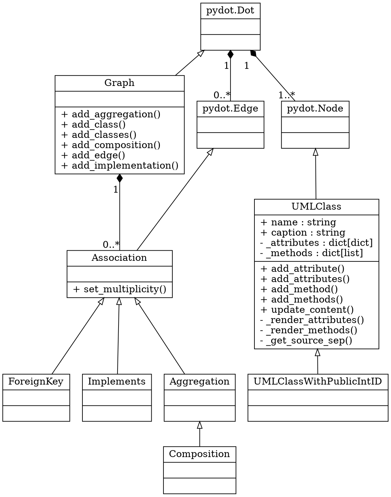
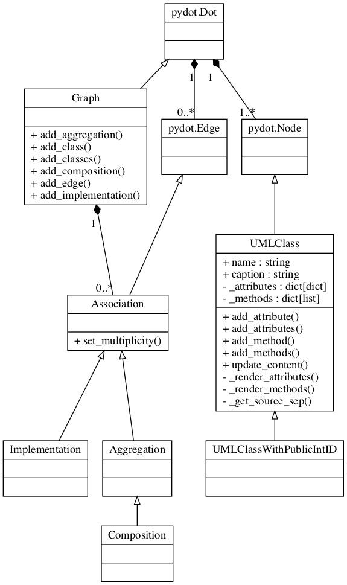

# pyUML
Create simple Graphviz dot UML graphs with a python script.

For example, as you can see step by step in the usage 
[notebook](./doc/usage.ipynb),
```python
from pyUML import Graph, UMLClass

graph = Graph('pyUML')

graph_dot = UMLClass(
    "pydot.Dot"
)
graph.add_class(graph_dot)

graph_class = UMLClass(
    "GraphClass",
    caption="Graph",
    methods=["add_aggregation()", "add_class()", "add_classes()", 
             "add_composition()", "add_edge()", "add_implementation()"]
)
graph.add_class(graph_class)
graph.add_implementation(graph_class, graph_dot)

node = UMLClass(
    "pydot.Node"
)
graph.add_classes(node)

uml_class = UMLClass(
    "UMLClass",
    attributes={
        "public": {
            "name": "string",
            "caption": "string"},
        "private": {
            "_attributes": "dict[dict]",
            "_methods": "dict[list]"
        }
    },
    methods={
        "public": ["add_attribute()", "add_attributes()", "add_method()",
             "add_methods()", "update_content()"],
        "private": ["_render_attributes()", "_render_methods()", "_get_source_sep()"]
    })
graph.add_class(uml_class)
graph.add_implementation(uml_class, node)

uml_class_with_id = UMLClass(
    "UMLClassWithPublicIntID")
graph.add_class(uml_class_with_id)
graph.add_implementation(uml_class_with_id, uml_class)

edge = UMLClass(
    "pydot.Edge")

association = UMLClass(
    "Association",
    methods=["set_multiplicity()"])

implements = UMLClass(
    "Implements")

aggregation = UMLClass(
    "Aggregation")

composition = UMLClass(
    "Composition")

graph.add_classes(edge, association, foreign_key, implements, aggregation, composition)
graph.add_implementation(association, edge)
graph.add_implementation(foreign_key, association)
graph.add_implementation(implements, association)
graph.add_implementation(aggregation, association)
graph.add_implementation(composition, aggregation)

graph.add_composition(node, graph_dot, multiplicity_parent=1, multiplicity_child="1..*")
graph.add_composition(edge, graph_dot, multiplicity_parent=1, multiplicity_child="0..*")
graph.add_composition(association, graph_class, multiplicity_parent=1, multiplicity_child="0..*")
```
will be compiled into 

and give


